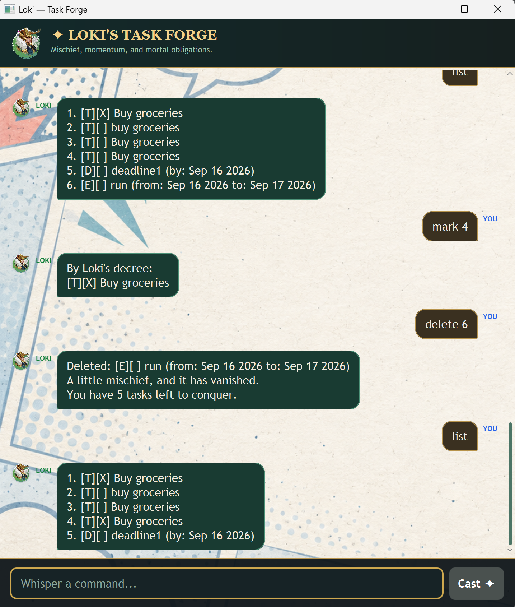

# Loki User Guide

Loki is a friendly task manager for to-dos, deadlines, and events. Enter commands
in the command box and press **Enter** or click **Cast ✦**.



## Getting started

1. Install [JDK 25](https://www.oracle.com/java/technologies/downloads/).
2. From the project root, run `./gradlew run` (on Windows, run `gradlew.bat run`).
3. Type `help` to see the complete command list.

Loki saves your tasks automatically when you exit or close the window. Tasks are
stored in `src/data/tasks.txt` and loaded the next time you start the application.

## Features

### Add a task

Use one of the following commands. The task is added to the end of the list.

| Task type | Format | Example |
| --- | --- | --- |
| To-do | `todo <description>` | `todo Buy groceries` |
| Deadline | `deadline <description> /by <date/time>` | `deadline Return book /by 20/9/2026 1800` |
| Event | `event <title> /from <date/time> /to <date/time>` | `event Project meeting /from 20/9/2026 1400 /to 20/9/2026 1600` |

### View your tasks

Use `list` to display all tasks in their current order. Loki numbers tasks from
1, and you use these numbers with `mark`, `unmark`, `delete`, and `update`.

```text
list
```

Task markers show both the type and status:

- `[T]` is a to-do, `[D]` is a deadline, and `[E]` is an event.
- `[ ]` means incomplete and `[X]` means complete.

### Complete or reopen a task

Mark a task as complete with `mark <task number>`:

```text
mark 1
```

If you need to reopen it, use `unmark <task number>`:

```text
unmark 1
```

### Delete a task

Delete a task by its current list number:

```text
delete 2
```

The remaining tasks are automatically renumbered.

### Update an existing task

Use `update <task number> <field> [<field> ...]`. You can update several fields
in one command; fields may appear in any order, and omitted fields are kept.
The task type cannot be changed.

| Existing task | Supported fields |
| --- | --- |
| To-do | `/title <new title>` |
| Deadline | `/title <new title>`, `/by <date/time>` |
| Event | `/title <new title>`, `/from <date/time>`, `/to <date/time>` |

Examples:

```text
update 1 /title Buy groceries and toiletries
update 2 /by 20/9/2026 1800
update 3 /title Final consultation /from 20/9/2026 1400 /to 20/9/2026 1600
```

An invalid update is rejected without changing the task.

### Use dates and times

For deadlines and events, use one of these formats:

- `yyyy-MM-dd` — for example, `2026-09-20` (midnight is assumed)
- `yyyy-MM-dd HHmm` — for example, `2026-09-20 1800`
- `d/M/yyyy HHmm` — for example, `20/9/2026 1800`

Use 24-hour time from `0000` to `2359`. Loki rejects impossible dates and events
whose start time is later than their end time.

### Get help or exit

- Type `help` to display all commands, supported fields, and examples.
- Type `exit` to save your tasks and close Loki.
- `faretheewell` is also accepted as an exit command.

## Tips

- Command keywords and update field markers are case-insensitive, so `LIST`,
  `Mark 1`, and `/TITLE` work too.
- Task numbers are one-based: the first task is task `1`.
- Loki displays a helpful error when a command is incomplete or invalid. Fix the
  command and try again; valid tasks already in your list are not changed.
